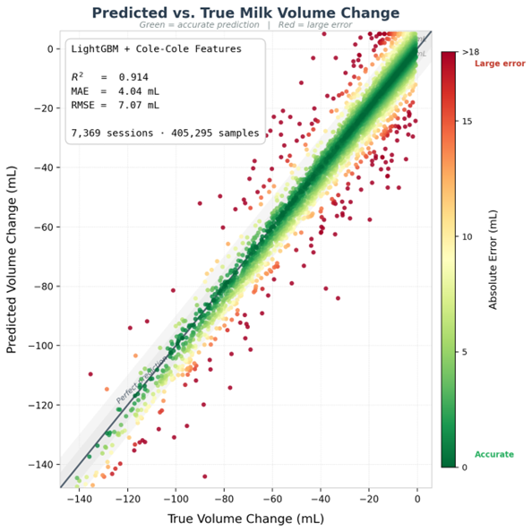

# Breastmilk Monitoring — ML Pipeline

Predicts fluid volume change (mL) in breast tissue from bioelectrical impedance spectroscopy (EIS) measurements, as a non-invasive alternative to weighing the infant before and after feeding.

- **Input**: complex impedance spectra across 4 electrode pairs at 30 log-spaced frequencies (0.1 Hz–10 kHz)
- **Output**: `fluid_diff_ml` — fluid volume change in mL (always negative; range −141 to −0.06 mL)
- **Best result**: LightGBM with Cole-Cole features — R² = 0.914, RMSE = 7.07 mL, MAE = 4.04 mL

---

## Pipeline Overview

```
Simulation Data
(7,369 replicates)
        │
        ▼
  data_loader.py
  ─────────────
  Reads 4 electrode-pair CSVs per replicate.
  Merges into one flat row per (rep, t_i, t_j).
        │
        ▼
   features.py  ←──  cole_cole.py
   ───────────        ────────────
   Two modes:         Fits Cole-Cole circuit
   • cole_cole        model to each spectrum.
   • raw
        │
        ├──────────────────────────────────────┐
        ▼                                      ▼
     train.py                       mlp_train.py / cnn_train.py
     ────────                       ──────────────────────────
     LightGBM regressor             PyTorch MLP / 1D CNN
     Group split by rep_id          Group split by rep_id
        │                                      │
        └──────────────┬───────────────────────┘
                       ▼
              output/ (plots, models)
```

---

## Repository Structure

```
Code/
├── data_loader.py        # loads simulation data, merges 4 electrode pairs per row
├── cole_cole.py          # Cole-Cole circuit fitting
├── features.py           # feature extraction (raw or cole_cole mode)
├── train.py              # LightGBM
├── mlp_train.py          # PyTorch MLP
└── cnn_train.py          # PyTorch 1D CNN
```

---

## Data

Synthetic simulation dataset: **7,369 replicates**, **405,295 rows** total.

Each replicate is a folder named `rep_N_gauss_Xa_sY/`, containing one subdirectory per electrode pair:

```
rep_1_gauss_0.5a_s42/
├── electrode1-electrode2/impedance_differences.csv
├── electrode1-electrode3/impedance_differences.csv
├── electrode1-electrode4/impedance_differences.csv
└── electrode3-electrode4/impedance_differences.csv
```

Each `impedance_differences.csv` contains:

| Column | Description |
|--------|-------------|
| `Z1_<freq>_real/imag` | Impedance spectrum before feeding (30 frequencies) |
| `Z2_<freq>_real/imag` | Impedance spectrum after feeding (30 frequencies) |
| `deltaZ_<freq>_real/imag` | ΔZ = Z2 − Z1 (30 frequencies) |
| `dt_steps` | Time steps between measurements (1–10) |
| `fluid_diff_ml` | **Target**: fluid volume change in mL |

**Class imbalance**: `dt=1` rows (mean −3.9 mL) are ~10× more frequent than `dt=10` rows (mean −39 mL). This is a key challenge for the models.

**Data path**: place the extracted data at `data/data/` relative to the project root, or update `_CANDIDATE_ROOTS` in `data_loader.py`.

---

## Code Documentation

### `data_loader.py` — Data Loading

Loads the simulation data from disk and combines all 4 electrode pairs into a single flat row per observation.

**Key functions:**

`_find_data_root()`
Tries multiple candidate paths to locate the data directory. Raises `FileNotFoundError` with a helpful message if none are found. Update `_CANDIDATE_ROOTS` at the top of the file if your data is in a non-standard location.

`load_rep(rep_dir)`
Loads one replicate. Reads each of the 4 electrode-pair CSVs, prefixes all impedance columns with the pair name (e.g. `electrode1_electrode2__Z1_0.10_real`) to avoid name collisions, then concatenates them horizontally alongside metadata columns (`rep_id`, `gauss`, `seed`, `t_i`, `t_j`, `dt_steps`, `fluid_diff_ml`). Returns one row per time-step pair.

`load_sample(n_reps, seed)`
Loads a random sample of `n_reps` replicates. Used for quick development and testing.

`load_all(n_workers=4)`
Loads all replicates in parallel using `ProcessPoolExecutor`. Use for final training runs.

---

### `cole_cole.py` — Circuit Model Fitting

Fits the Cole-Cole bioimpedance model to a measured impedance spectrum. This is the physics-informed core of the feature pipeline.

**Model equation:**

```
Z(ω) = R∞ + (R0 − R∞) / (1 + (jωτ)^α)
```

| Parameter | Physical meaning |
|-----------|-----------------|
| `R0` | Resistance at DC (low-freq limit) — reflects extracellular fluid volume |
| `R∞` | Resistance at infinite frequency — reflects total water content |
| `fc` | Characteristic frequency (Hz), where τ = 1 / (2π·fc) |
| `α` | Dispersion exponent (0 < α ≤ 1) — describes how broad the relaxation is |

**Key functions:**

`cole_cole_complex(freqs, R0, R_inf, fc, alpha)`
Returns the theoretical complex impedance array for a given set of parameters and frequencies.

`fit_cole_cole(freqs, z_real, z_imag)`
Fits Cole-Cole parameters to a measured spectrum using `scipy.optimize.least_squares` (up to 1000 iterations). Uses `log(fc)` internally for numerical stability. Residuals are normalised by `|Z|` so all frequencies contribute equally regardless of magnitude. Returns a dict with `R0`, `R_inf`, `fc`, `alpha`, and `fit_rmse`. Returns NaNs if fitting fails.

---

### `features.py` — Feature Extraction

Extracts ML features from raw impedance spectra. Supports two modes selected via `--features`.

#### Mode: `cole_cole` — 373 features (recommended)

For each electrode pair, calls `fit_cole_cole` on Z1 and Z2, then computes deltas and spectral summaries. Per pair (93 features):

| Group | Features | Count |
|-------|----------|-------|
| Cole-Cole params — Z1 | R0, R∞, fc, α, fit_rmse | 5 |
| Cole-Cole params — Z2 | R0, R∞, fc, α, fit_rmse | 5 |
| Parameter deltas (Z2 − Z1) | ΔR0, ΔR∞, Δfc, Δα | 4 |
| Spectral summaries — Z1 | magnitude at low/high freq, LH ratio, phase at low/high freq, peak reactance frequency, peak reactance value | 7 |
| Spectral summaries — Z2 | same | 7 |
| Spectral deltas | Z2 − Z1 for 5 summary stats | 5 |
| Raw ΔZ spectrum | real + imag at all 30 frequencies | 60 |

4 pairs × 93 features + `dt_steps` scalar = **373 total**.

#### Mode: `raw` — 720 features

Full Z1, Z2, ΔZ spectra (real + imag) at all 30 frequencies across 4 pairs. No circuit fitting required — faster to extract but loses the physics structure.

**Key functions:**

`extract_features_for_pair(df, pair, mode)`
Given a raw `impedance_differences` DataFrame for one electrode pair, returns a DataFrame of extracted features (one row per observation).

`load_rep_features(rep_dir, mode)`
Loads one replicate and extracts features for all 4 pairs, then merges with metadata.

`load_sample_features(n_reps, seed, mode)` / `load_all_features(n_workers, mode)`
Same interface as `data_loader.py` but returns physics features instead of raw spectra.

---

### `train.py` — LightGBM

Trains a LightGBM gradient boosting model on Cole-Cole or raw features.

**Train/val/test split**: `GroupShuffleSplit` by `rep_id` — 70% train, 15% validation, 15% test. Group-based split ensures no replicate appears in more than one set, preventing data leakage.

**Model configuration:**

| Hyperparameter | Value |
|----------------|-------|
| `n_estimators` | 2000 |
| `learning_rate` | 0.05 |
| `num_leaves` | 63 |
| `subsample` | 0.8 |
| `colsample_bytree` | 0.8 |
| Early stopping | patience = 50 (on validation set) |

**Outputs** (saved to `OUTPUT_DIR`):
- `<tag>_pred_vs_actual.png` — scatter plot of predictions vs. ground truth
- `<tag>_feature_importance.png` — top 30 feature importances
- `<tag>.pkl` — saved model (loadable with `joblib.load`)

---

### `mlp_train.py` — PyTorch MLP

Trains a multi-layer perceptron on raw spectral features.

**Input**: 720 raw features (4 pairs × 6 signals × 30 frequencies) + `dt_steps` = **721 features**. Input is standardised with `StandardScaler`.

**Architecture:**

```
Input (721)
    │
Linear(721→512) → BatchNorm → ReLU → Dropout(0.3)
    │
Linear(512→256) → BatchNorm → ReLU → Dropout(0.3)
    │
Linear(256→128) → BatchNorm → ReLU → Dropout(0.3)
    │
Linear(128→1)
```

**Training:**
- Optimiser: Adam, lr=1e-3, weight_decay=1e-4
- LR scheduler: `ReduceLROnPlateau` (factor=0.5, patience=10 epochs)
- Early stopping: patience=20 epochs (restores best weights)
- Max epochs: 150

---

### `cnn_train.py` — PyTorch 1D CNN

Treats the frequency axis as a 1D signal and applies convolutional layers to learn frequency-domain patterns.

**Input format**: the 30-frequency spectra are arranged into a `(batch, 24, 30)` tensor:
- 24 channels = 4 electrode pairs × 6 signals (Z1_real, Z1_imag, Z2_real, Z2_imag, ΔZ_real, ΔZ_imag)
- 30 frequency points along the signal axis

`dt_steps` is injected as a scalar after the convolutional layers.

**Architecture:**

```
Spectral input: (B, 24, 30)
    │
Conv1d(24→64,  k=3, pad=1) → BatchNorm → ReLU
Conv1d(64→128, k=3, pad=1) → BatchNorm → ReLU → MaxPool1d(2)      → (B, 128, 15)
Conv1d(128→128,k=3, pad=1) → BatchNorm → ReLU → AdaptiveAvgPool(4) → (B, 128, 4)
    │
Flatten → (B, 512)
    │
Concat with dt_steps → (B, 513)
    │
Linear(513→256) → BatchNorm → ReLU → Dropout(0.3)
Linear(256→64)  → ReLU → Dropout(0.3)
Linear(64→1)
```

Each of the 24 channels is normalised independently (mean and std computed over the training batch and frequency axis).

---

## Model Comparison

All models use a group-based 70/15/15 split by replicate ID to prevent data leakage.

| Model | File | Features | R² | RMSE (mL) | MAE (mL) |
|-------|------|----------|----|-----------|----------|
| LightGBM | `train.py` | cole_cole | **0.914** | **7.07** | **4.04** |
| MLP (512→256→128) | `mlp_train.py` | raw | 0.716 | 12.84 | 8.59 |
| 1D CNN | `cnn_train.py` | raw | 0.680 | 13.63 | 9.38 |

**Key finding**: Physics-informed Cole-Cole features substantially outperform raw spectra. LightGBM with Cole-Cole features achieves R²=0.914, roughly halving the error of the deep learning models that operate on raw impedance values.

### Predicted vs. True — LightGBM



---

## Experiments

Hardware platform: **MAX30001G EV Kit** (Analog Devices) — a single-chip analog front-end for ECG and bioimpedance measurement.

---

### Experiment 1 — Potato Tissue BioZ (Hardware Validation)

**Date**: June 4, 2026
**Purpose**: Validate that the MAX30001G can detect ionic composition differences in biological tissue — a prerequisite before moving to breast tissue measurements.

**Setup**:
- Configuration: bipolar 2-electrode (sense and drive share the same physical contacts via DP_BP / DN_BN jumpers)
- Electrodes: ECG snap electrodes inserted directly into potato flesh
- Samples: dry potato (control) vs. saline-soaked potato
- Frequency sweep: 6 manual points — 125, 250, 500, 1000, 2000, 4000 Hz

**Measured |Z| at each frequency:**

| Frequency | Dry \|Z\| (kΩ) | Saline \|Z\| (kΩ) | Difference |
|-----------|---------------|------------------|------------|
| 125 Hz | 870.4 | 871.5 | +0.1% |
| 250 Hz | 759.3 | 761.8 | +0.3% |
| 500 Hz | 571.8 | 525.7 | −8.1% |
| 1 kHz | 359.9 | 311.8 | −13.4% |
| 2 kHz | 199.6 | 130.3 | −34.7% |
| 4 kHz | 103.2 | 36.2 | **−64.9%** |

**Cole-Cole model fit** (Z(ω) = R∞ + (R0 − R∞) / (1 + (jωτ)^α)):

| Parameter | Dry Potato | Saline Potato |
|-----------|-----------|---------------|
| fc (characteristic frequency) | 415 Hz | 343 Hz |
| α (dispersion exponent) | 0.94 | 1.00 |

**Key findings**:
- At 4 kHz, saline tissue shows **64.9% lower impedance** than dry tissue, confirming increased extracellular ionic conductivity from Na⁺ and Cl⁻ ions
- Below 250 Hz both samples are indistinguishable — cell membranes block ionic current regardless of extracellular salt content
- α = 1.00 for saline indicates Debye relaxation (single dominant time constant, consistent with a uniform ionic medium); dry potato α = 0.94 reflects distributed relaxation from heterogeneous tissue

**Limitations**:
- Bipolar electrodes include electrode contact impedance in the reading — a tetrapolar (4-electrode) setup would isolate tissue impedance alone
- MAX30001G outputs magnitude |Z| only, not phase — Cole-Cole reconstruction is estimated from model fitting rather than direct measurement

Full report: [`experiments/experiment_1/potato_bioz_report.html`](experiments/experiment_1/potato_bioz_report.html)

Data: [`experiments/experiment_1/data/`](experiments/experiment_1/data/)

---

### Experiment 2 — *(coming soon)*

---

## Setup

```bash
pip install -r requirements.txt
```

Update `OUTPUT_DIR` at the top of each training script to your preferred output path:

```python
OUTPUT_DIR = Path("your/output/path")
```

---

## Usage

```bash
# LightGBM
python Code/train.py --features cole_cole --sample 0

# MLP
python Code/mlp_train.py --sample 0

# CNN
python Code/cnn_train.py --sample 0
```

---

## Requirements

```
numpy
pandas
scipy
lightgbm
torch
scikit-learn
matplotlib
joblib
```
